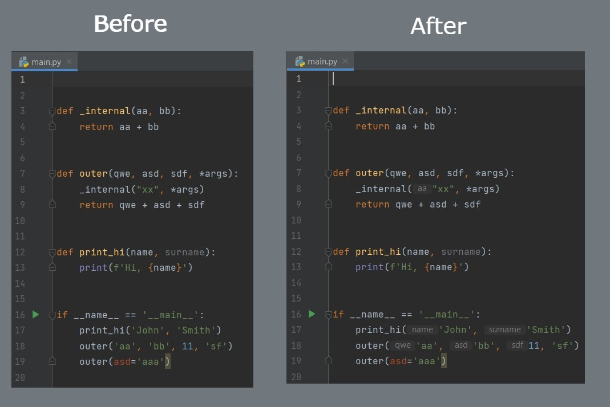

# Python Parameter Inlay Putter

This plugin will add inlay hints to the function calls in Python.
Compatible with PyCharm IDE.

Build status:

## Installation
- download jar file from releases
- open Settings -> Plugins
- click the gear icon at the top and then select "Install Plugin from Disk..."

It is possible to disable inlay hints in Settings -> Editor -> Inlay Hints -> Python

Example of what does it look like before/after:

## TODO

- add unit tests (partially done)
- do not generate anything inside external libs code
- add blacklist for builtins (partially done)
- ignore "self" param in case of class (partially done)
- do not generate anything for named params such as: func(name="value") - done
